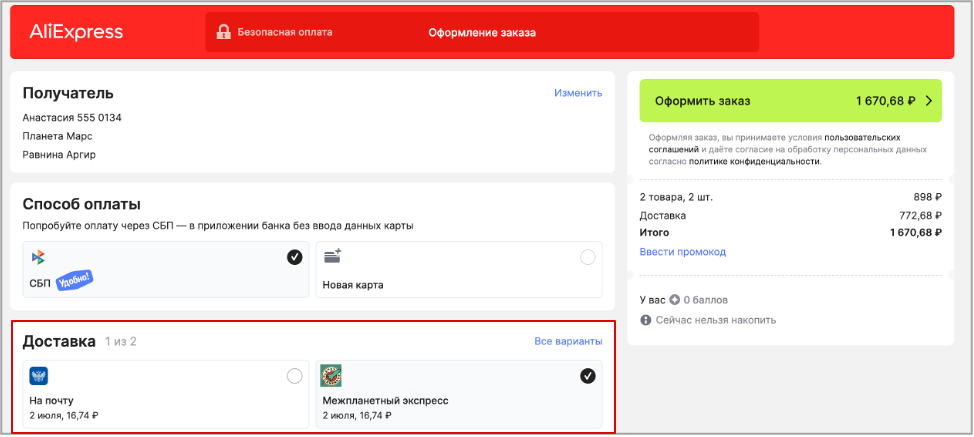
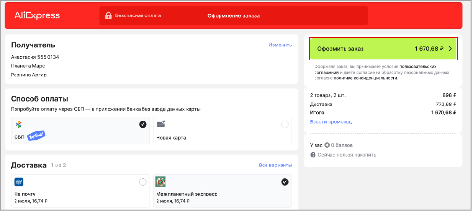

# Как сделать заказ на Марс

AliExpress доставляет товары в любую точку Земли. Теперь AliExpress открывает новые горизонты. Доставка товаров доступна и на *****Марс*****!
Наша инструкция поможет заказать товары с AliExpress в каждый уголок Красной планеты.

Для просмотра товара, изучения характеристик и отзывов регистрация не нужна. Однако, если захотите оформить заказ, необходимо зарегистрироваться.

 ## Два способа войти или зарегистрироваться на AliExpress

Чтобы выполнить вход или пройти регистрацию нажмите **Войти** в верхнем правом углу или **Купить сейчас** в карточке товара.

## По номеру телефона

Введите свой номер телефона в открывшееся окно. 

Дождитесь SMS с кодом подтверждения и введите его в соответствующее поле. 

 
## По Мультипаспорту

Введите номер своего мультипаспорта в открывшееся окно. 

Позвоните оператору технической поддержки для идентификации по номеру 555 1212. Введите код, полученный от оператора, в соответствующее поле.

## Заказ товара

После регистрации вы можете заказать любой товар, представленный на нашей площадке.

Выберите товары и добавьте их в корзину.

Перейдите в корзину и нажмите **К оформлению**.

  
В блоке **Получатель** укажите свои данные, а также адрес.

При необходимости отредактируйте данные, нажав **Изменить**.

 Выберите способ оплаты товаров:
* **Картой**;
* **Через Систему Быстрых Платежей (СБП)**.

 Выберите один из способов доставки:
* **На почту** – доставка осуществляется Почтой России, доступна только для планеты Земля;
* **Межпланетный экспресс** – курьер доставит вашу посылку до двери в пределах Солнечной системы.
 

Теперь все готово, нажмите **Оформить заказ**.

 
Ваш товар будет доставлен на Марс выбранным способом в ближайшее время.
