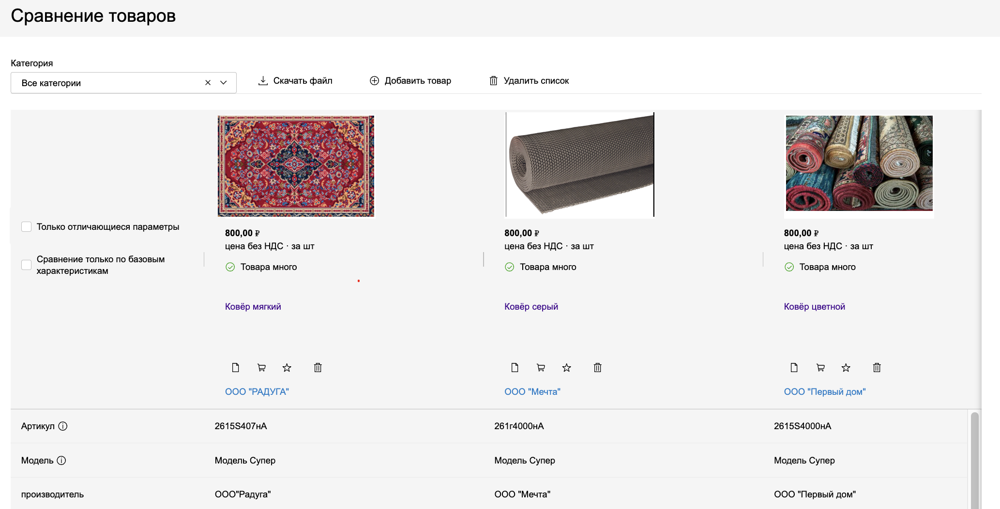
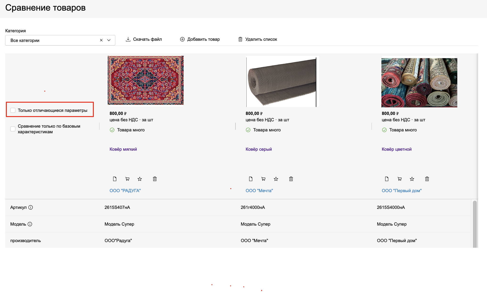
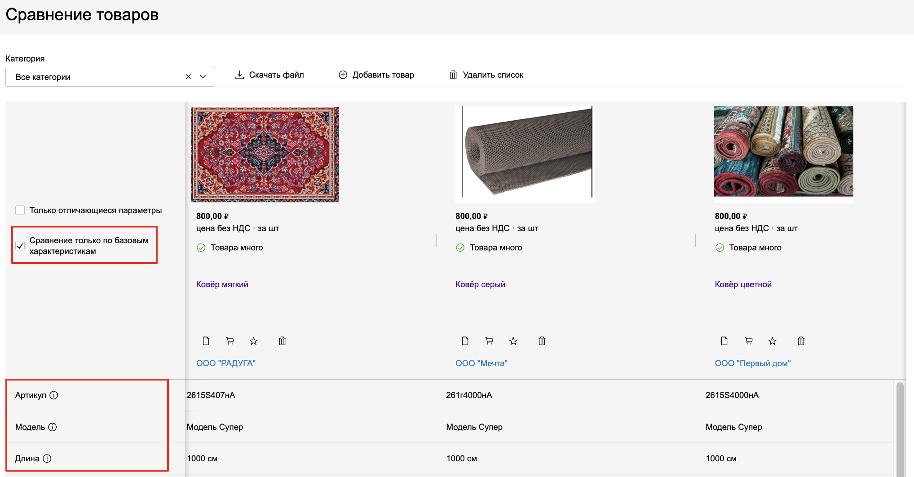
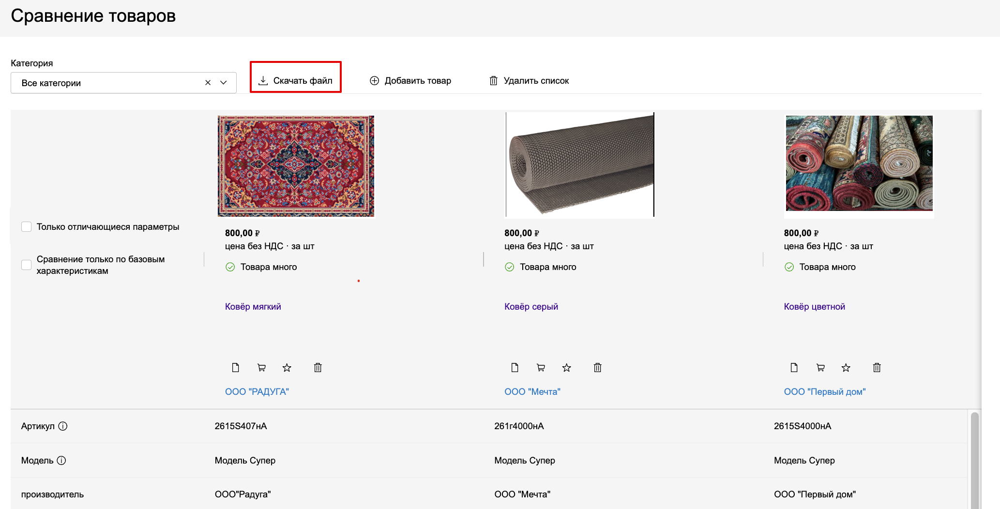

# Cравнение товаров
В Системе предусмотрена возможность сравнивать товары по их характеристикам для удобства выбора оптимального варианта товара.
1. Добавить товар в сравнение можно двумя способами: со страницы списка товаров и из карточки товара.
    1.1 Чтобы добавить товар в сравнение со страницы списка товаров, установите отметку в поле **Сравнить**.   Отобразится всплывающее уведомление с кнопкой для перехода на страницу сравнения.
    
    1.2 Аналогичное поле с возможностью установить в нем отметку присутствует и в карточке товара.
    
    1.3 Аналогичное поле с возможностью установить в нем отметку присутствует и в карточке товара.
    
    1.4 Аналогичное поле с возможностью установить в нем отметку присутствует и в карточке товара.
    
1. Также вы можете добавить в сравнение **Похожие товары**. Для этого в одноименном блоке карточки товара нажмите на значок диаграммы. 
1. Чтобы перейти к сравнению товаров, нажмите на кнопку перехода в вышеупомянутом всплывающем уведомлении, либо на значок диаграммы в горизонтальном меню в верхней части страницы.
1. Отобразится страница сравнения:
1. При необходимости установите отметкув поле **Только отличающиеся параметры** – в нижней части страницы отобразится перечень характеристик, которыми различаются выбранные для сравнения товары.
1. Возможно **сравнение товаров только по базовым характеристикам** – для этого установите отметку в одноименном поле. 
1. Чтобы скачать результаты сравнения товаров в формате .xlsx, нажмите кнопку **Скачать файл**
Файл будет сформирован на основе выбранных значений в фильтре **Категория** и установленных отметок в полях **Только отличающиеся параметры**, **Сравнение товаров только по базовым характеристикам**. 
1. Скачанный файл также содержит вкладку **Похожие товары**, где по каждому товару из сравнительной таблицы представлено до пяти единиц похожих товаров со ссылками на их карточки в Системе.